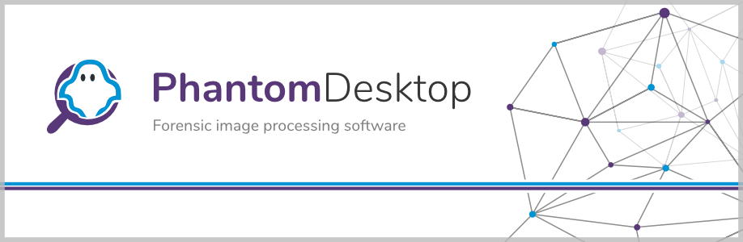

[](https://github.com/jhm-ciberman/phantom-desktop/actions/workflows/build.yaml)


Phantom Desktop is an application for forensic digital image processing.

## Download

At the moment Phantom desktop is in development. Releases will be available soon.

## Contributing
### Initial setup:

Phantom desktop uses git submodules, so you need to clone the repository and then initialize the submodules:

```bash
git clone git@github.com:jhm-ciberman/phantom-desktop.git
cd ./phantom-desktop
git submodule update --init --recursive
```

After that, create a virtual environment, activate it, and install the pip requirements:

```bash
python -m venv .env
source .env/Scripts/activate
pip install -r requirements.txt
```

### Running

To run Phantom Desktop from the command line, use the following command:

```bash
python src/main.py
```

Or in VSCode, you can use the "Run" command, it's already configured for this project in the launch.json file.

### Building

To generate an executable file that can be distributed, run the following command:

```bash
python setup.py build
```

This will use [cx_Freeze](https://cx-freeze.readthedocs.io/en/latest/) to generate an executable file according to the current operating system. The output files will be placed in the `build` folder ready to be distributed.

### Pulling changes from GitHub

This project uses git submodules, so to pull the latest changes from GitHub, run the following command:

```bash
git pull --recurse-submodules
```

This will pull the latest changes from the main repository and update the submodules as well if required.

### Code conventions

This project uses Qt and thus, it tries to follow the Qt style for all classes that inherit from `QObject`. The rest of the code follows the [PEP8](https://www.python.org/dev/peps/pep-0008/) style guide.

For more info please refer to [this](http://bitesofcode.blogspot.com/2011/10/pyqt-coding-style-guidelines.html) blog post.

For Docstrings, the project uses the [Google style](https://github.com/google/styleguide/blob/gh-pages/pyguide.md#38-comments-and-docstrings).

The project has some type hints, but it's only for basic IDE autocomplete. It's not intended for use with static type checkers.

## Phantom Project File format

The phantom project file format (`*.phantom`) is an open format and it's specification can be found [here](./docs/phantom_project_file_format.md). The specification is still in development and it's subject to change.